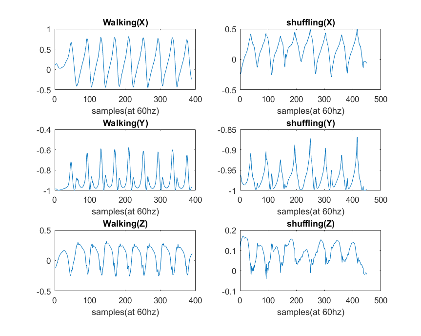

**Pages:** | [Home](https://rickyroze.github.io/QEA2_Project1/ "home") | [Algorithm](https://rickyroze.github.io/QEA2_Project1/Algorithm "algorithm") |
# **Algorithm Development**
---

## Motion Model and Sensors
---
> For our purposes, however, as well as our user group, we decided that a sensor placed on the shoe or foot of the wearer would provide us with the best possible data, while being able to best discern between walking and shuffling. This greatly reduced the degrees of freedom that we had to account for, as our original idea was to have the user's phone collect the data; however, it made some of our data more noisy as a result. 

...insert picture here...

As seen in the motion sketches above, there were two major components that seemed the most different between our initial model of shuffling versus our model of walking. First, the vertical (y-axis) movement in walking was one of the critical indicators of walking. In shuffling, it is much less likely for someone to lift their feet to the extent of walking, since it is more of a cautious gait movement. As seen in the time domain plots below, the shuffling samples in the Y-axis of the accelerometer data is much less prominent in shuffling versus walking, and the magnitude of the peaks in the frequency domain is also about half of that of walking. The first prominent peak in both graphs seems to be half the step cycle, and the second most prominent is the full step cycle. However, the respective frequencies in the shuffling data that correspond to the ones in the walking data have half to less than half of the magnitude. 

## Next Steps

To expand this product out more, the next steps for development would be to create a way for the sensor to detect falls, as one of the main reasons falls happen in the elderly is due to shuffling. In addition to this, further iteration of our motion model would be useful in making this a more robust system, and working with our user group to find the best method of data collection would be critical to further development of Shuffler. Another application would be that after an injury in someone who may be prone to shuffling, it would be helpful to determine if their gait pattern is improving or degrading. With this information, it could be determined wheather or not further medical attention (such as physical therapy) is required.  
